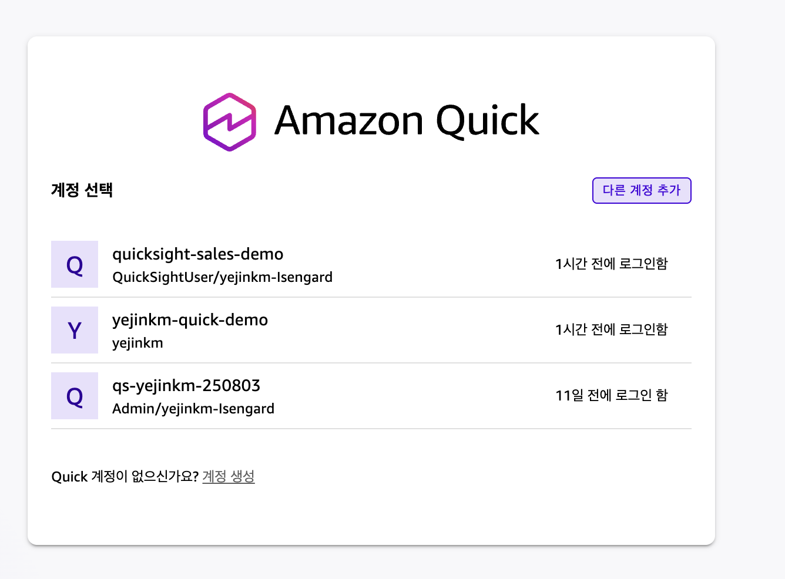
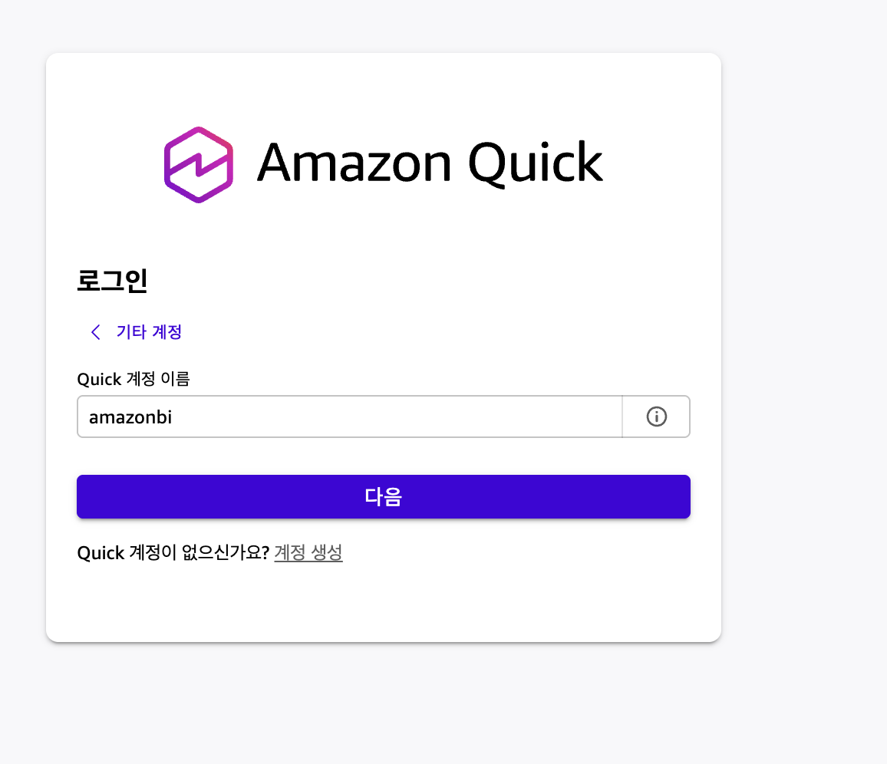

# Quick Advanced Workshop - 참가자용 따라하기

> Amazon Quick Desktop (amazonbi 계정) 핸즈온. 화면 보면서 순서대로 따라가면 됩니다.

이 워크샵은 Amazon Quick의 핵심 기능(Skills, Connection, Scheduled Agent, Apps, Knowledge Graph, Browser)을 실습으로 익히는 과정입니다. 코드를 직접 작성하지 않고 채팅으로 지시하는 방식으로, 재사용 가능한 Skill을 만들고 실제 업무에 바로 적용해봅니다.

---

## 준비 (시작 전 확인)

**1. Quick Desktop 로그인**

Quick Desktop 앱 실행 → 계정 선택 화면에서 **"다른 계정 추가"** → **"Quick 계정 이름"** 에 `amazonbi` 입력 → **다음** → 회사 계정으로 로그인 (이미 amazonbi로 로그인해 뒀으면 계정 선택 화면에서 고르기만 하면 됩니다)

<figure><figcaption>계정 선택 화면</figcaption></figure>

<figure><figcaption>amazonbi 로그인</figcaption></figure>

**2. 어시스턴트 확인**

채팅 창 왼쪽 위 어시스턴트가 **"Quick"** 으로 선택돼 있는지 확인합니다.

<figure><figcaption>어시스턴트 선택</figcaption></figure>

**3. 로컬 파일 연결**

로컬 파일 쓸 거면: **Settings → Capabilities → Connectors → Local files** 에 워크샵 자료 폴더 추가.

**4. 채팅 모드**

응답이 얕으면 채팅 모드를 **Smart** 로 전환 (Fast / Balanced / Smart 중, 기본이자 최고 품질이 Smart). 더 깊게 필요하면 **Thinking** 토글 켜기.

---

## 이 워크샵에서 쓰는 데이터

실습용으로 미리 준비된 한국어 샘플 데이터입니다. 참가자 전원이 똑같은 결과를 내도록 통제된 자료이고, 로컬 폴더(OneDrive 마운트)에 들어 있습니다. 실제 본인 데이터가 아니니 마음 편히 써도 됩니다.

<table><thead><tr><th width="200">파일/폴더</th><th>내용</th><th width="200">어디서 쓰나</th></tr></thead><tbody><tr><td><code>./research-folder/</code></td><td>"리워드 프로그램 도입" 관련 조사 자료 (시장·고객·비용 등)</td><td>STEP 2 (보고서·덱 생성)</td></tr><tr><td><code>./call-transcripts/</code></td><td>영업 콜 녹취록 5개 (한국어). 대표 파일: <code>discovery-acme-corp.txt</code>(한빛테크), <code>discovery-globex.txt</code></td><td>STEP 3 (리드 평가·후속 이메일)</td></tr><tr><td><code>./customer-usage.csv</code></td><td>고객사별 API 사용량 데이터 (고객사·세그먼트·호출수 등)</td><td>STEP 4 (대시보드), STEP 6-2 (Apps)</td></tr></tbody></table>

> **파일이 안 열리면:** **Settings → Capabilities → Connectors → Local files** 에 위 폴더가 추가돼 있는지 확인하세요. 경로의 `./` 는 그 연결된 폴더 기준입니다.

---

## 실습 순서

1. [STEP 2. 첫 Skill 만들기 — branded-report](step-2-branded-report.md)
2. [STEP 3. 두 번째 Skill — qualify-lead (직접)](step-3-qualify-lead.md)
3. [STEP 4. 인터랙티브 HTML 대시보드 — insight-dashboard](step-4-insight-dashboard.md)
4. [STEP 5. Connection — 외부 도구 연결](step-5-connection.md)
5. [STEP 6. Quick 차별 기능](step-6-quick-features.md)
6. [STEP 7. 최종 체크](step-7-checklist.md)
7. [막히면 (트러블슈팅)](troubleshooting.md)
