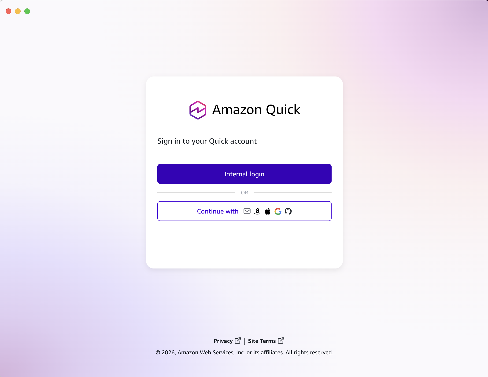
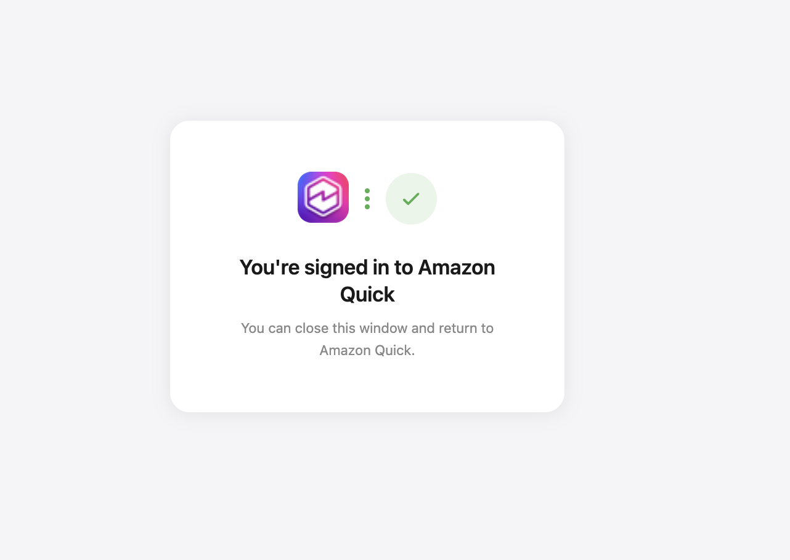
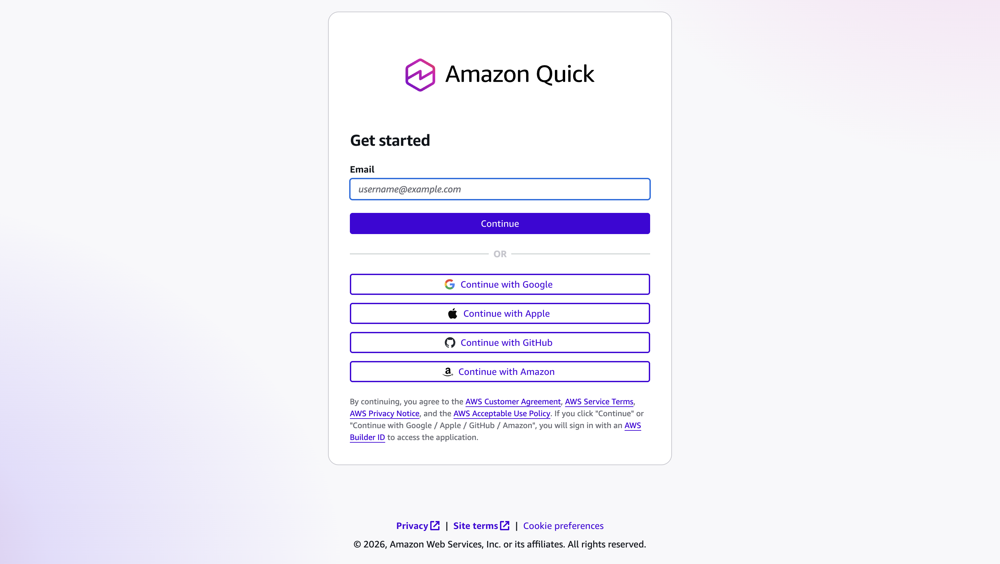
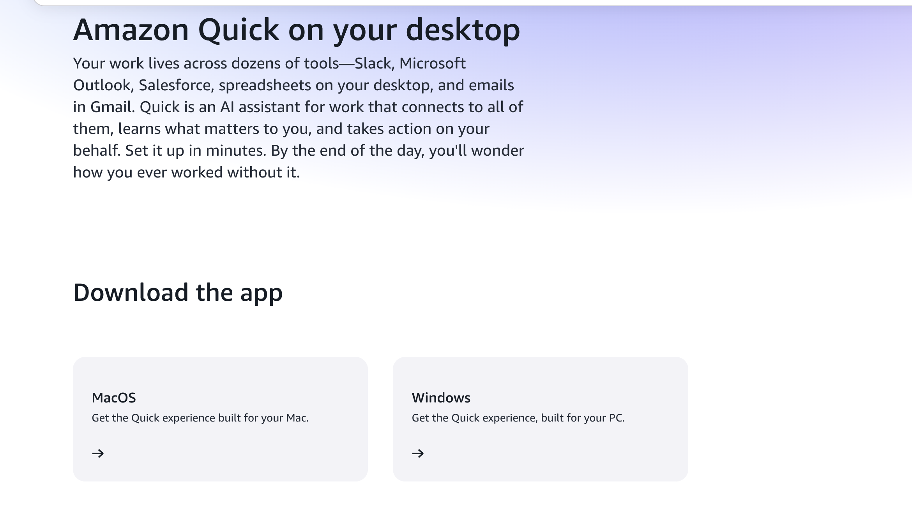
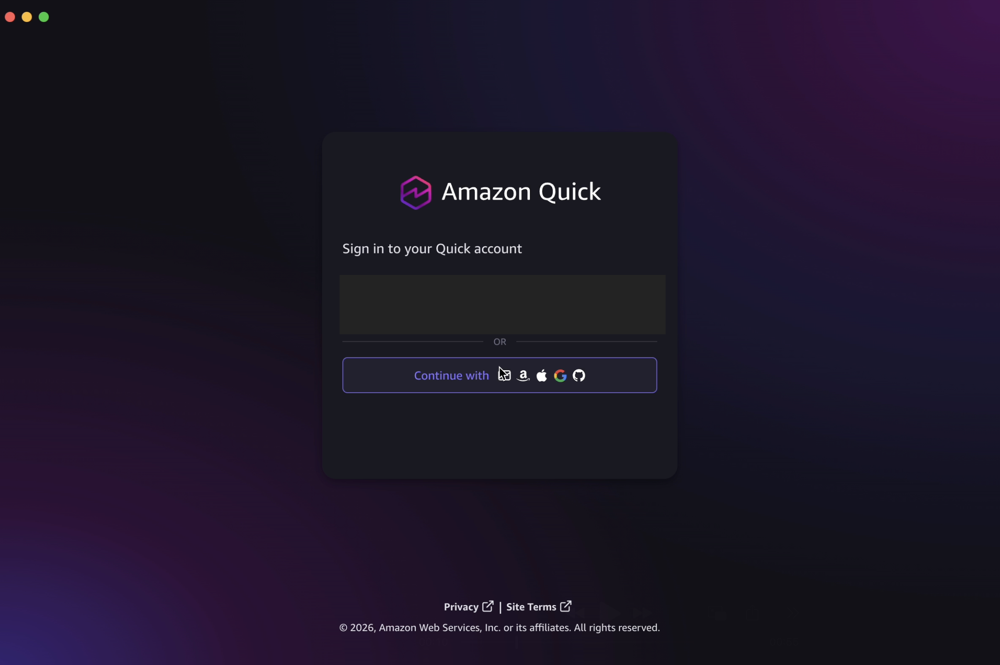
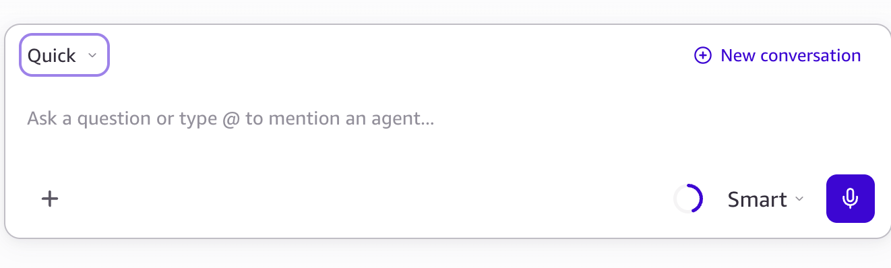
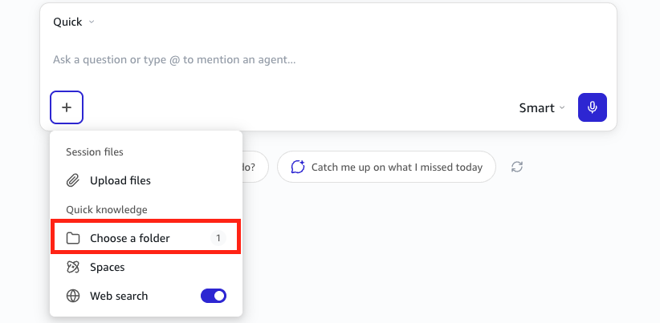

# Amazon Quick 실전 워크샵

> 채팅으로 만드는 나만의 업무 자동화 도구

이 워크샵은 Amazon Quick의 핵심 기능(Skills, Connection, Scheduled Agent, Apps, Knowledge Graph, Browser)을 실습으로 익히는 과정입니다. 코드를 직접 작성하지 않고 채팅으로 지시하는 방식으로, 재사용 가능한 Skill을 만들고 실제 업무에 바로 적용해봅니다.

---

## 준비 (시작 전 확인)

**1. Quick Desktop 로그인**

Amazon 임직원과 외부 사용자가 경로가 다릅니다. 본인 상황에 맞는 섹션만 따라 하시면 됩니다.

<strong>▶ Amazon 임직원인 경우</strong>

Quick Desktop 앱을 실행하면 로그인 화면이 뜹니다. **"Internal login"** 버튼을 눌러 회사 계정으로 로그인해 주세요.

<figure><figcaption>Amazon Quick 로그인 화면 — Internal login 사용</figcaption></figure>

로그인이 완료되면 아래 화면이 뜹니다. 창을 닫고 Quick Desktop 앱으로 돌아오시면 됩니다.

<figure><figcaption>로그인이 완료된 상태 — 창을 닫고 Quick으로 돌아오면 됩니다</figcaption></figure>

<strong>▶ 외부 사용자인 경우 (Amazon 계정 없음)</strong>

Quick 계정을 새로 만들고 Desktop 앱을 설치하는 순서로 진행합니다. 신용카드도, AWS 계정도 필요 없어요. (첫 가입 사용자에게는 자동으로 30일 Quick Plus + Desktop 액세스가 제공됩니다.)

**① Quick 계정 생성**

1. 브라우저에서 [aws.amazon.com/quick](https://aws.amazon.com/quick) 로 이동
2. **Sign Up** (또는 **"Try Quick for Free"**) 클릭
3. 로그인 방법 선택: 이메일 / Google / Apple / GitHub / Amazon 계정 중 하나
4. 안내가 나오면 이메일 인증까지 완료

<figure><figcaption>Amazon Quick 가입 페이지 — 원하는 로그인 방법 선택</figcaption></figure>

**② Quick Desktop 설치**

1. [aws.amazon.com/quick/desktop](https://aws.amazon.com/quick/desktop) 으로 이동
2. 사용 중인 OS(macOS 또는 Windows)에 맞는 **Download** 클릭
3. 설치:
   - **Mac:** `.dmg` 파일을 열고 Amazon Quick을 `Applications` 폴더로 드래그 → 실행
   - **Windows:** `.exe` 설치 프로그램 실행 후 안내대로 진행 → 시작 메뉴에서 실행
4. macOS에서 "인터넷에서 다운로드한 앱을 열까요?" 확인이 뜨면 **Open** 클릭

<figure><figcaption>OS에 맞는 Download 버튼 클릭</figcaption></figure>

**③ 로그인**

1. Amazon Quick Desktop을 실행하면 로그인 화면이 뜹니다
2. **Sign In** 클릭 → 브라우저 창에서 ①에서 만든 Quick 계정으로 로그인
3. 앱에 최초 설정 화면이 뜨고, 완료되면 홈 화면으로 이동합니다
4. Quick Desktop이 바로 도구를 연결하도록 안내합니다. 지금 연결해도 되고, 건너뛴 뒤 STEP 4에서 연결해도 됩니다.

<figure><figcaption>Quick Desktop 로그인 화면 — Sign In 클릭</figcaption></figure>

**2. 어시스턴트 확인**

채팅 창 왼쪽 위 어시스턴트가 **"Quick"** 으로 선택돼 있는지 확인합니다.

<figure><figcaption>어시스턴트 선택</figcaption></figure>

**3. 채팅 모드**

채팅 모드는 Fast / Balanced / Smart 세 가지 중 **Smart** 로 두고 시작합니다 (기본값이자 가장 품질이 좋음). 좀 더 깊게 생각하게 하려면 **Thinking** 토글도 함께 켜주세요.

---

## 워크샵에서 쓰는 데이터

실습용으로 미리 준비된 샘플 데이터 세트입니다. Sales 시나리오(STEP 1~3)와 운영보고서 시나리오(STEP 6)에서 함께 사용합니다.
> **📥 다운로드:** [quick-workshop-data.zip](https://github.com/parkminju20211126/gitbook-quick-workshop/raw/master/quick-workshop-data.zip)
>
> zip을 받아서 원하는 위치에 압축을 풀어주세요. 그런 다음 채팅 입력창 왼쪽 아래의 **`+` 버튼 → Quick knowledge → Choose a folder** 를 눌러 방금 압축을 푼 폴더를 지정하면 됩니다. 이후 실습에 나오는 `./` 경로는 전부 이 폴더 기준이에요.

<figure><figcaption>+ 버튼 → Quick knowledge → Choose a folder</figcaption></figure>

<table><thead><tr><th width="200">파일/폴더</th><th>내용</th><th width="200">어디서 쓰나</th></tr></thead><tbody><tr><td><code>./research-folder/</code></td><td>"리워드 프로그램 도입" 관련 조사 자료 (시장·고객·비용 등)</td><td>STEP 1 (보고서·덱 생성)</td></tr><tr><td><code>./call-transcripts/</code></td><td>영업 콜 녹취록 5개 (한국어). 대표 파일: <code>discovery-acme-corp.txt</code>(한빛테크), <code>discovery-globex.txt</code></td><td>STEP 2 (리드 평가·후속 이메일)</td></tr><tr><td><code>./customer-usage.csv</code></td><td>고객사별 API 사용량 데이터 (고객사·세그먼트·호출수 등)</td><td>STEP 3 (대시보드), STEP 5-2 (Apps)</td></tr><tr><td><code>./ops-data/</code></td><td>가상 고객사 "클라우드메이트"의 운영 데이터 4종: · <code>ops-billing.csv</code> (6~7월 서비스별 비용·사용량) · <code>ops-monitoring.csv</code> (7월 일별 모니터링 지표) · <code>ops-resources.csv</code> (리소스 인벤토리) · <code>ops-findings.md</code> (Health·Trusted Advisor 특이사항 + 내부 티켓)</td><td>STEP 6 (운영보고서 자동 생성)</td></tr></tbody></table>

---

## 실습 순서

1. [STEP 1. 첫 Skill 만들기 — branded-report](step-1-branded-report.md)
2. [STEP 2. 두 번째 Skill — qualify-lead (직접)](step-2-qualify-lead.md)
3. [STEP 3. 인터랙티브 HTML 대시보드 — insight-dashboard](step-3-insight-dashboard.md)
4. [STEP 4. Connection — 외부 도구 연결](step-4-connection.md)
5. [STEP 5. Quick 차별 기능](step-5-quick-features.md)
6. [STEP 6. 운영보고서 자동 생성 — ops-report](step-7-ops-report.md)
7. [STEP 7. 최종 체크](step-6-checklist.md)
8. [트러블슈팅](troubleshooting.md)
