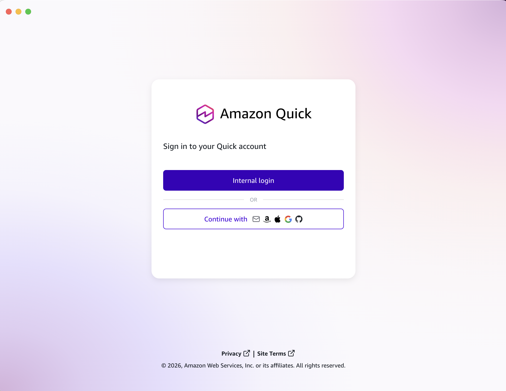
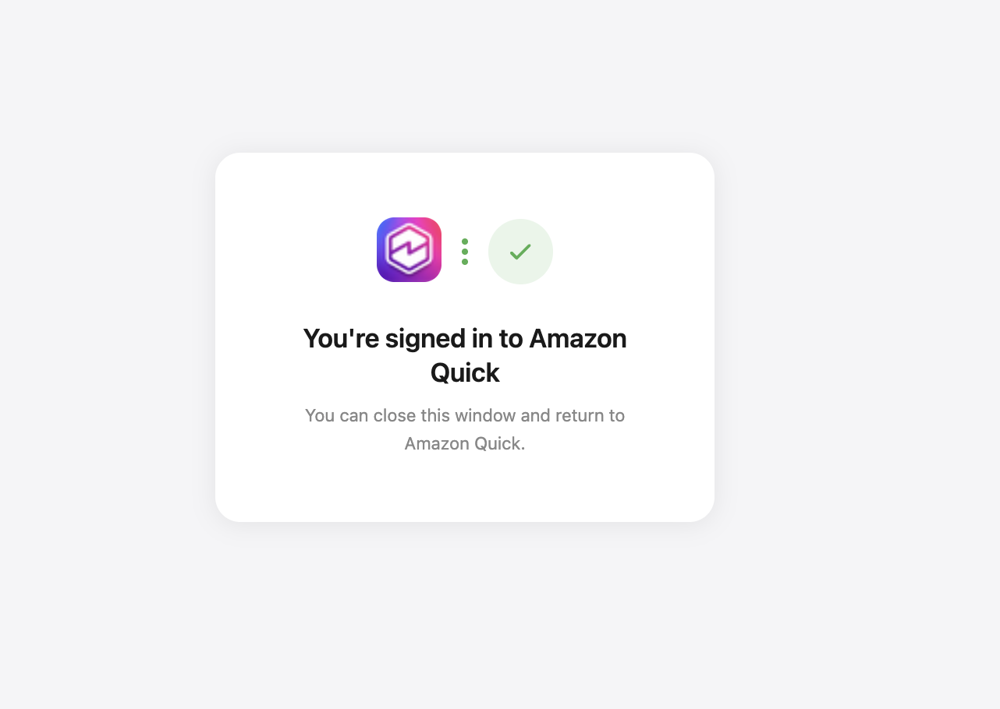
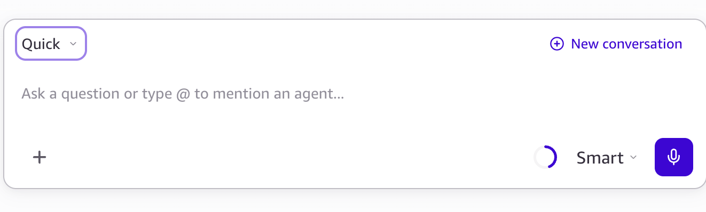
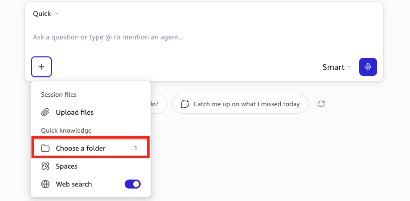

# Amazon Quick Hands-on Workshop

> 🌐 [한국어 버전 →](../README.md)

> Build your own work automation tools through chat.

This workshop is a hands-on program for learning Amazon Quick's core features (Skills, Connection, Scheduled Agent, Apps, Knowledge Graph, Browser). Instead of writing code yourself, you'll give instructions through chat, build reusable Skills, and apply them directly to real work.

---

## Preparation (Before you start)

**1. Sign in to Quick Desktop**

Launch the Quick Desktop app and the sign-in screen appears. Click **"Internal login"** to sign in with your corporate account. (If you're using an external account, pick one of the **"Continue with"** options below.)

<figure><figcaption>Amazon Quick sign-in screen</figcaption></figure>

Once signed in, the screen below appears. Close the window and return to the Quick Desktop app.

<figure><figcaption>Sign-in complete — close the window and return to Quick</figcaption></figure>

**2. Check the assistant**

Confirm that the assistant at the top-left of the chat window is set to **"Quick"**.

<figure><figcaption>Assistant selection</figcaption></figure>

**3. Chat mode**

Among the three chat modes — Fast / Balanced / Smart — start with **Smart** (the default and highest quality). To make it think more deeply, also turn on the **Thinking** toggle.

---

## Workshop data

Sales sample data prepared for the hands-on labs.
> **📥 Download:** [quick-workshop-data.zip](https://github.com/parkminju20211126/gitbook-quick-workshop/raw/master/quick-workshop-data.zip)
>
> Grab the zip and extract it wherever you like. Then click the **`+` button at the bottom-left of the chat input → Quick knowledge → Choose a folder** and point it at the folder you just extracted. From here on, every `./` path in the labs is relative to that folder.

<figure><figcaption>+ button → Quick knowledge → Choose a folder</figcaption></figure>

<table><thead><tr><th width="200">File / Folder</th><th>Contents</th><th width="200">Used in</th></tr></thead><tbody><tr><td><code>./research-folder/</code></td><td>Research materials on "launching a rewards program" (market, customers, cost, etc.)</td><td>STEP 1 (report / deck generation)</td></tr><tr><td><code>./call-transcripts/</code></td><td>Five sales call transcripts (Korean). Featured files: <code>discovery-acme-corp.txt</code> (Hanbit Tech), <code>discovery-globex.txt</code></td><td>STEP 2 (lead qualification / follow-up email)</td></tr><tr><td><code>./customer-usage.csv</code></td><td>API usage data by customer (customer, segment, call count, etc.)</td><td>STEP 3 (dashboard), STEP 5-2 (Apps)</td></tr></tbody></table>

---

## Lab order

1. [STEP 1. Build your first Skill — branded-report](step-1-branded-report.md)
2. [STEP 2. Second Skill — qualify-lead (hands-on)](step-2-qualify-lead.md)
3. [STEP 3. Interactive HTML dashboard — insight-dashboard](step-3-insight-dashboard.md)
4. [STEP 4. Connection — connect external tools](step-4-connection.md)
5. [STEP 5. Quick's distinctive features](step-5-quick-features.md)
6. [STEP 6. Final check](step-6-checklist.md)
7. [Troubleshooting](troubleshooting.md)
