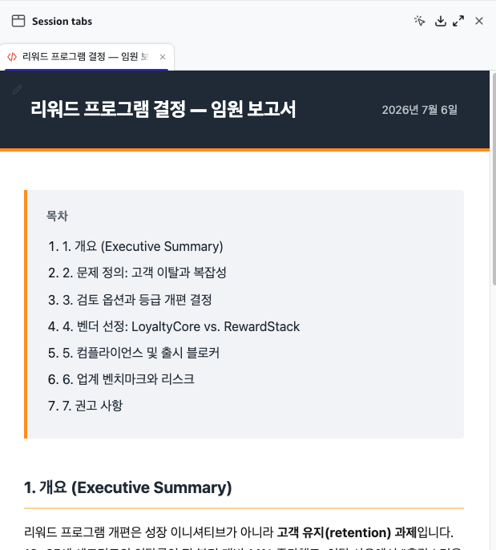
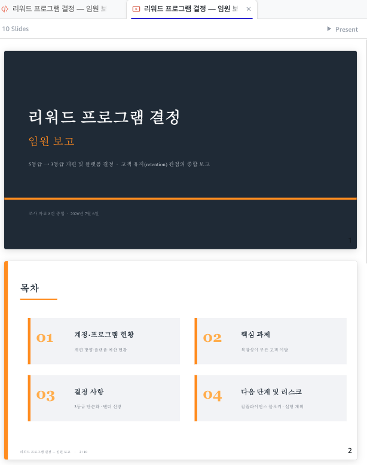

# STEP 1. Build your first Skill — branded-report

> Create a Skill that automatically generates an executive-report-style HTML. Once built, just saying "make me a report" triggers this Skill automatically.

---

## ① Skill creation prompt

Paste the following prompt into chat and send it.

```
Create a Skill named branded-report. This Skill should generate an HTML report with a professional executive-report feel. Please follow these design rules exactly.

[Brand colors]
- Dark color #232F3E, accent color #FF9900, white background

[Layout]
1. Header band: Full-width dark background (#232F3E) band at the very top of the page. Title on the left (white, bold), date on the right (light gray). A 4px orange (#FF9900) line below the band.
2. Content column: Center-aligned (max width ~840px) with generous left/right margins.
3. Table of contents: Light-background box with a 4px orange left border at the top of the content.
4. Section headings: Light orange underline below each.
5. Callout box: Key conclusions get a cream background (#FFF8F0) with a 4px orange left border.
6. Tables: Header row on a dark background (#232F3E) with white text; body rows alternate light gray.
7. Clean system font, generous whitespace.
8. Footer: "Generated with Amazon Quick"

[Body language]
- Write the report body in English

[Save location]
- Save reports to the ./output/ folder. Create the folder if it doesn't exist. Filename format: report-YYYY-MM-DD.html.

[Auto-trigger]
- Auto-apply this Skill whenever the word "report" is mentioned.

Save the Skill so it can be reused.
```

---

## ② Approve permissions

If asked for permission → **Allow**.

## ③ Verify creation

If you see `branded-report` in the left **Agents & skills panel**, you're set.

---

## ④ Try it out

```
Create an executive report using the research materials in the ./research-folder/ folder. Title it "Rewards Program Decision — Executive Report".
```

You'll get an HTML report that looks something like this.

<figure><figcaption>Example of an executive report generated by the branded-report Skill</figcaption></figure>

---

## ⑤ (Optional) Presentation deck

```
Using the research materials in the ./research-folder/ folder, create an executive presentation deck on "Rewards Program Decision". Include: account status, key challenges, decisions, and next steps. Before creating it, show me the slide outline first and get my approval.
```

→ Once the outline appears, approve it → a `.pptx` file is generated.

<figure><figcaption>Example of the presentation deck generated after approval</figcaption></figure>

---

> **Next:** [STEP 2. Build the qualify-lead Skill →](step-2-qualify-lead.md)
