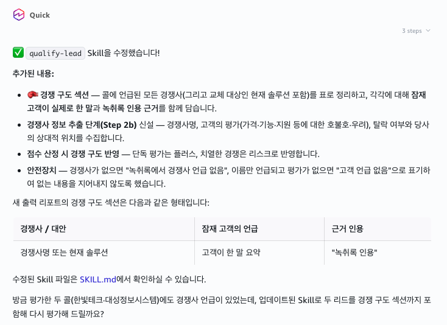
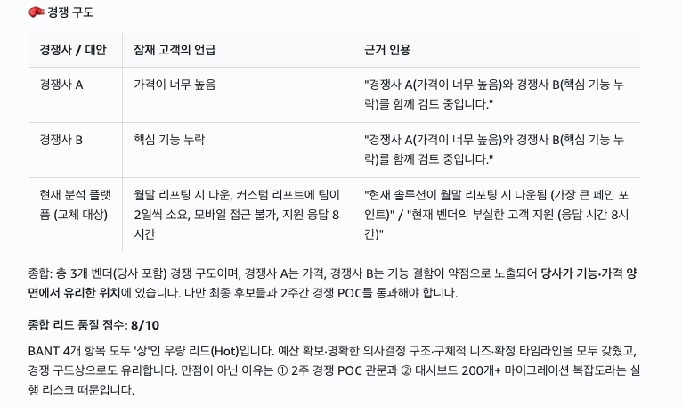
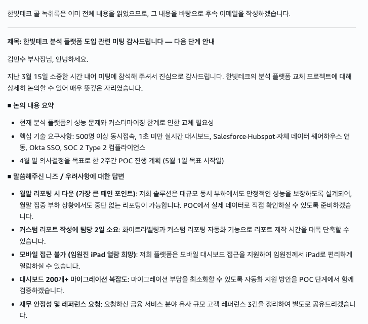

# STEP 2. Second Skill — qualify-lead (hands-on)

> Build a Skill yourself that evaluates sales call transcripts with the BANT framework. Then chain it with a follow-up-email Skill to complete the lead-qualification → follow-up-email-draft workflow.

---

## ① Create the Skill

```
Create a Skill named qualify-lead. This Skill should read sales call transcripts and evaluate leads using the BANT framework (Budget, Authority, Need, Timeline).

For each call, write the following in English:
- An assessment of each of the 4 BANT items with a confidence level (High / Medium / Low), plus supporting quotes from the transcript
- An overall lead-quality score from 1 to 10
- Recommended next steps
- Risk factors or red flags

Auto-apply this Skill whenever I ask to qualify a lead or review a sales call.

Save the Skill so it can be reused.
```

---

## ② Test

```
Qualify the lead from the call transcript at ./call-transcripts/discovery-acme-corp.txt.
```

You'll get a report like this with BANT-by-item assessments and supporting evidence.

<figure><figcaption>Lead qualification report for the Hanbit Tech call</figcaption></figure>

---

## ③ (Optional) Compare

```
Also qualify the lead from the ./call-transcripts/discovery-globex.txt call and compare it with Hanbit Tech. Which is the more promising opportunity?
```

It qualifies both leads side by side and tells you which is more promising.

<figure><figcaption>Globex (Daesung Information Systems) lead qualification, compared against Hanbit Tech</figcaption></figure>

---

## ④ (Optional) Improve the Skill

```
Update the qualify-lead Skill so that it also captures competitors mentioned during the call and what the prospect said about them.
```

The Skill is updated with a single chat message, and future qualifications automatically include a "Competitive landscape" section.

<figure><figcaption>A competitor-extraction step is added to the Skill</figcaption></figure>

Re-run qualification with the updated Skill and a table like this comes along.

<figure><figcaption>Example of the newly added "Competitive landscape" section</figcaption></figure>

> **Tip:** You can modify a Skill through chat at any time. Say "add X to this Skill" and the SKILL file is updated.

---

## ⑤ (Optional) Build the follow-up-email Skill

```
Create a Skill named follow-up-email. Based on a sales call transcript, it should draft a personalized follow-up email in English to send to that customer.

The email should include:
- A summary of the key points discussed on the call
- Responses to the needs and concerns the customer expressed
- The next steps that were agreed on
- A polite, professional tone

Auto-apply this Skill whenever I say "write a follow-up email" after a lead qualification. Save it so it can be reused.
```

Try it:

```
Draft a follow-up email based on the Hanbit Tech call I just qualified.
```

You get an email draft that naturally weaves in responses to the issues, requests, and needs raised during the call.

<figure><figcaption>Follow-up email draft generated from the Hanbit Tech call</figcaption></figure>

---

> **Next:** [STEP 3. Interactive HTML dashboard →](step-3-insight-dashboard.md)
