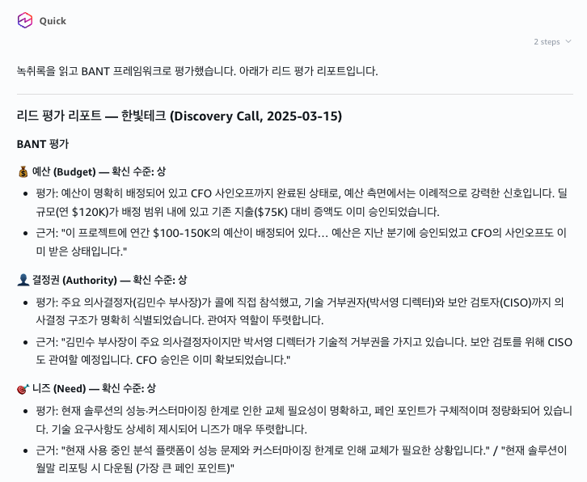
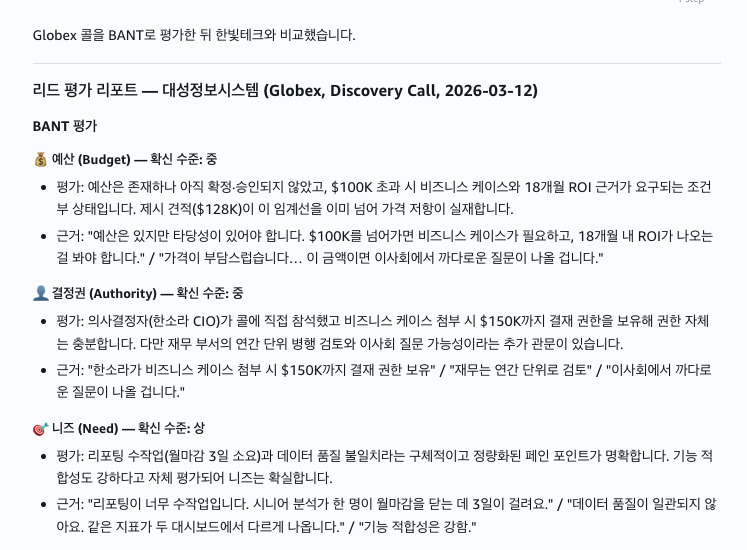

# STEP 2. 두 번째 Skill — qualify-lead (직접)

> 영업 콜 녹취록을 BANT 프레임워크로 평가하는 Skill을 직접 만들어봅니다. 이어서 follow-up-email Skill까지 연결하면 리드 평가 → 후속 이메일 초안 작성 흐름이 완성됩니다.

---

## ① Skill 생성

```
qualify-lead 라는 이름의 Skill을 만들어줘. 이 Skill은 영업 콜 녹취록을 읽고 BANT 프레임워크(예산 Budget, 결정권 Authority, 니즈 Need, 시점 Timeline)로 리드를 평가해야 해.

각 콜에 대해 다음을 한국어로 작성해줘:
- BANT 4개 항목별 평가와 확신 수준(상 / 중 / 하), 그리고 녹취록에서 인용한 근거
- 1~10점의 종합 리드 품질 점수
- 권장 다음 단계
- 리스크 요인이나 위험 신호

리드를 평가하거나 영업 콜을 검토해달라고 요청하면 이 Skill이 자동으로 적용되도록 해줘.

재사용할 수 있게 Skill을 저장해줘.
```

---

## ② 테스트

```
./call-transcripts/discovery-acme-corp.txt 콜 녹취록의 리드를 평가해줘.
```

이런 식으로 BANT 항목별 평가와 근거가 정리된 리포트가 나옵니다.

<figure><figcaption>한빛테크 콜에 대한 리드 평가 리포트</figcaption></figure>

---

## ③ (선택) 비교

```
./call-transcripts/discovery-globex.txt 콜의 리드도 평가하고, 한빛테크와 비교해줘. 어느 쪽이 더 유망한 기회야?
```

두 콜의 리드를 나란히 평가해서 어느 쪽이 더 유망한지 비교해 줍니다.

<figure><figcaption>Globex(대성정보시스템) 리드 평가 및 한빛테크와의 비교</figcaption></figure>

---

## ④ (선택) Skill 개선

```
qualify-lead Skill을 수정해서, 콜에 언급된 경쟁사와 잠재 고객이 그에 대해 한 말도 정리하도록 해줘.
```

> **Tip:** Skill은 언제든 대화로 수정할 수 있습니다. "이 Skill에 X를 추가해줘"라고 말하면 SKILL 파일이 업데이트됩니다.

---

## ⑤ (선택) follow-up-email Skill 생성

```
follow-up-email 이라는 이름의 Skill을 만들어줘. 영업 콜 녹취록을 바탕으로 그 고객에게 보낼 개인화된 후속 이메일 초안을 한국어로 작성해야 해.

이메일에는 다음을 포함해줘:
- 콜에서 논의된 핵심 내용 요약
- 고객이 표현한 니즈와 우려사항에 대한 응답
- 합의된 다음 단계
- 정중하고 전문적인 톤

리드 평가가 끝난 뒤 "후속 이메일 써줘"라고 하면 이 Skill이 자동 적용되도록 해줘. 재사용할 수 있게 저장해줘.
```

써보기:

```
방금 평가한 한빛테크 콜을 바탕으로 후속 이메일 초안을 써줘.
```

---

> **다음:** [STEP 3. 인터랙티브 HTML 대시보드 →](step-3-insight-dashboard.md)
