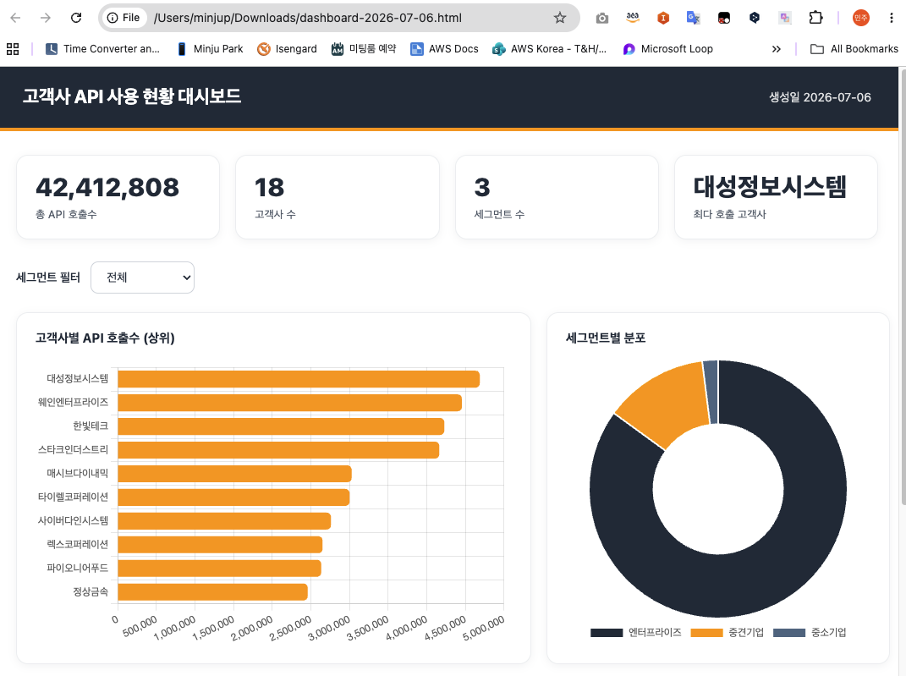

# STEP 3. 인터랙티브 HTML 대시보드 — insight-dashboard

> STEP 1이 "정적 보고서"라면, 이건 마우스로 필터/클릭하는 **인터랙티브 대시보드**를 HTML 한 파일로 만듭니다. 브라우저로 바로 열리고 서버가 필요 없습니다.

---

## ① Skill 생성

```
insight-dashboard 라는 이름의 Skill을 만들어줘. 이 Skill은 데이터나 분석 결과를 받아서 인터랙티브한 HTML 대시보드를 단일 파일로 생성해야 해. 아래 기준을 정확히 지켜줘.

[기술 방식]
- 외부 라이브러리는 CDN으로만 불러오고(Chart.js 등), 결과는 단일 HTML 파일 하나로 완결되게 해줘. 브라우저로 더블클릭하면 바로 열려야 해. 별도 설치나 서버 실행이 필요 없어야 해.

[브랜드 색상]
- 진한 색 #232F3E, 강조색 #FF9900, 배경 흰색

[레이아웃]
1. 상단 헤더 띠: 전체 폭 진한 배경(#232F3E), 왼쪽에 대시보드 제목(흰색 굵게), 오른쪽에 생성 날짜. 띠 아래 4px 주황색(#FF9900) 라인.
2. KPI 카드 줄: 헤더 바로 아래에 핵심 지표 3~4개를 카드로. 카드마다 큰 숫자 + 라벨.
3. 차트 영역: 막대/도넛/라인 등 데이터에 맞는 차트 2~3개. 차트는 반응형(창 크기에 맞게).
4. 필터: 상단에 드롭다운이나 버튼으로 세그먼트/기간 등을 고르면 차트와 표가 실시간으로 갱신.
5. 상세 표: 하단에 정렬 가능한 표(헤더 클릭 시 정렬). 헤더 행 진한 배경(#232F3E) 흰 글씨, 본문 한 줄 걸러 연한 회색.
6. 깔끔한 시스템 폰트, 카드/차트에 옅은 그림자와 둥근 모서리, 여백 넉넉히.

[본문 언어]
- 라벨과 설명은 한국어로 작성

[저장 위치]
- ./output/ 폴더에 저장. 폴더 없으면 생성. 파일명은 dashboard-YYYY-MM-DD.html 형식.

[자동 적용]
- "대시보드"라는 단어가 언급되면 이 Skill이 자동 적용되도록.

재사용할 수 있게 Skill을 저장해줘.
```

---

## ② 권한 승인

권한 물어보면 → **허용**.

## ③ 생성 확인

**Agents & skills 패널**에 `insight-dashboard`가 보이면 성공입니다.

---

## ④ 바로 써보기

```
./customer-usage.csv 데이터로 인터랙티브 대시보드를 만들어줘. 고객사별 API 호출수, 세그먼트별 분포, 상위 고객사를 보여주고, 세그먼트로 필터할 수 있게 해줘.
```

→ 생성된 `./output/dashboard-YYYY-MM-DD.html` 을 더블클릭하면 브라우저에서 바로 열립니다.

<figure><figcaption>브라우저로 연 대시보드 예시 (KPI 카드 · 상위 고객사 막대 · 세그먼트 도넛 · 필터)</figcaption></figure>

---

## ⑤ (선택) 대화로 계속 다듬기

```
방금 만든 대시보드에 "월별 추이" 라인 차트를 추가하고, 상위 5개 고객사만 강조해줘.
```

---

> **STEP 5-2의 "Apps"와 차이:** Apps는 Quick 안에서 쓰는 앱, 이건 **HTML 파일로 떨어져서 누구에게나 공유 가능**(이메일 첨부·SharePoint 업로드).

---

> **다음:** [STEP 4. Connection — 외부 도구 연결 →](step-4-connection.md)
