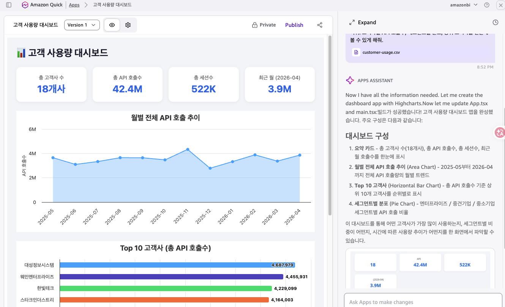
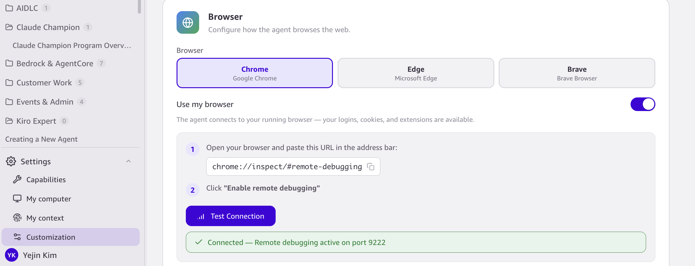
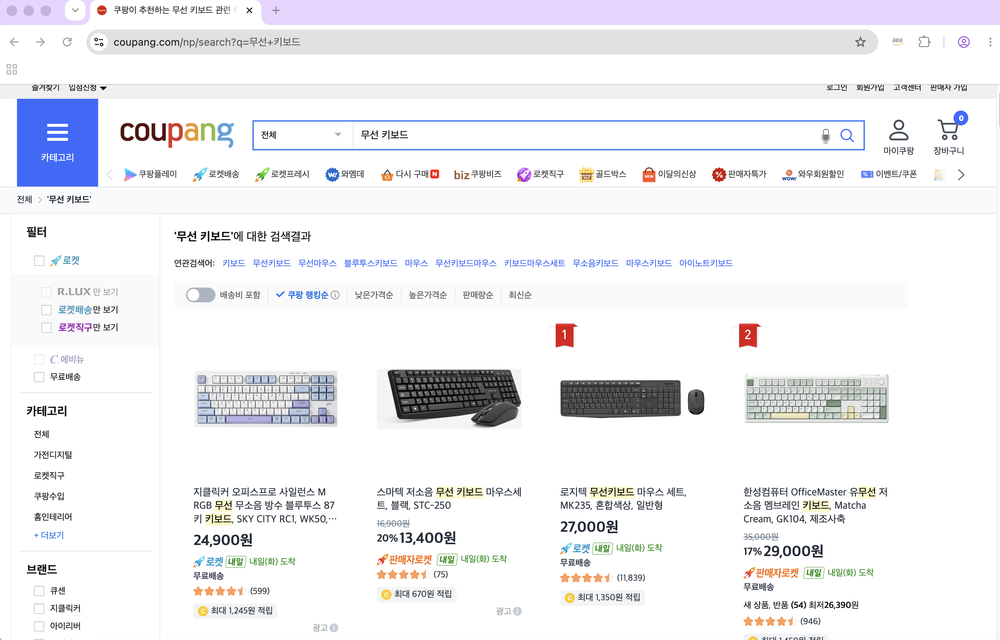
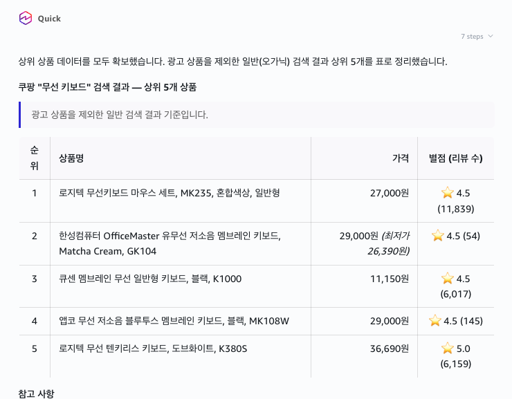

# STEP 5. Quick 차별 기능

> Quick만의 4가지 차별 기능을 훑어봅니다. Scheduled Agent · Apps · Knowledge Graph · Browser.

---

# STEP 5. Quick's distinctive features (English)

> A tour of Quick's four differentiating features: Scheduled Agent · Apps · Knowledge Graph · Browser.

---

## 5-1. Scheduled Agent

정해진 시간에 자동으로 도는 에이전트를 만듭니다.

```
매일 아침 8시에 내 이메일을 요약해서 알려주는 에이전트를 만들어줘.
```

→ 승인하면 생성 + 즉시 테스트 실행. 결과는 오른쪽 위 **Activity Feed** 에 표시됩니다.

> **주의:** 이메일 Connection이 필요합니다. (STEP 4에서 연결)

변형:

```
회의 30분 전에, 내가 준비 안 한 미팅이 있으면 알려주는 에이전트를 만들어줘.
```

---

## 5-1. Scheduled Agent (English)

Create an agent that runs automatically on a schedule.

```
Create an agent that summarizes my email and reports it to me every morning at 8 AM.
```

→ Approve it and it's created and test-run immediately. The result shows up in the **Activity Feed** at the top right.

> **Note:** Requires an email Connection. (Connected in STEP 4.)

Variation:

```
Create an agent that alerts me 30 minutes before a meeting if I haven't prepared for it.
```

---

## 5-2. Apps (대시보드)

Quick 안에서 쓰는 앱을 만듭니다. STEP 3의 HTML 대시보드와 달리 Quick 내부에서 실행됩니다.

```
./customer-usage.csv 데이터로 고객 사용량 대시보드 앱을 만들어줘. 고객사별 API 호출수, 세그먼트별 분포, 상위 고객사를 한눈에 볼 수 있게 해줘.
```

Quick 내부의 Apps 화면에서 요약 카드·월별 추이·Top 10 차트가 함께 있는 앱이 만들어집니다.

<figure><figcaption>Amazon Quick Apps 안에서 실행되는 고객 사용량 대시보드</figcaption></figure>

---

## 5-2. Apps (dashboard) (English)

Build an app that runs inside Quick. Unlike the STEP 3 HTML dashboard, this one runs inside Quick itself.

```
Build a customer-usage dashboard app from the ./customer-usage.csv data. Let me see API call counts by customer, distribution by segment, and top customers at a glance.
```

An app with summary cards, monthly trend, and Top 10 charts is generated in the Apps screen inside Quick.

<figure><figcaption>Customer-usage dashboard running inside Amazon Quick Apps</figcaption></figure>

---

## 5-3. Knowledge Graph

Quick이 축적한 내 컨텍스트(계정·사람·조직 관계)를 시각적으로 확인합니다.

**1.** **Settings**(왼쪽 아래 톱니) **→ My Context → Knowledge Graph** 를 엽니다.

**2.** 노드/관계를 확인합니다.

**3.** 채팅으로도 물어볼 수 있습니다.

```
내 Knowledge Graph 보여줘
```

또는

```
Quick이 [계정/사람]에 대해 뭘 알고 있어?
```

---

## 5-3. Knowledge Graph (English)

Visually inspect the context Quick has accumulated (accounts, people, organizational relationships).

**1.** Open **Settings** (gear icon at bottom-left) **→ My Context → Knowledge Graph**.

**2.** Inspect the nodes and relationships.

**3.** You can also ask through chat.

```
Show me my Knowledge Graph
```

or

```
What does Quick know about [account / person]?
```

---

## 5-4. Browser (진짜 웹에서 찾아오기)

**셋업:**

**Settings → Customization → Browser** → 브라우저 선택(Chrome 등) → **"Use my browser"** 토글 ON → 안내대로 `chrome://inspect/#remote-debugging` 붙여넣고 **Enable remote debugging** → **Test Connection** → "Connected" 확인.

<figure><figcaption>브라우저 커스터마이징</figcaption></figure>

**써보기:**

```
쿠팡에서 "무선 키보드" 검색 결과 페이지를 열어서, 상위 5개 상품의 이름·가격·별점을 표로 정리해줘.
```

→ Quick이 실제로 브라우저를 열어 페이지를 읽어옵니다. 내 로그인/쿠키 그대로 사용됩니다.

<figure><figcaption>Quick이 열어서 읽고 있는 쿠팡 "무선 키보드" 검색 결과 페이지</figcaption></figure>

<figure><figcaption>페이지에서 뽑아낸 상위 5개 상품을 이름·가격·별점 표로 정리한 결과</figcaption></figure>

> **팁:** 검색(네이버 등)은 사이트가 막아서 잘 안 될 수 있어요. 쿠팡 검색이 막히면 상품 **URL을 직접** 주고 "이 상품 리뷰 요약해줘"로 하는 게 확실합니다.

---

## 5-4. Browser (fetch from the real web) (English)

**Setup:**

**Settings → Customization → Browser** → pick a browser (Chrome, etc.) → toggle **"Use my browser"** ON → follow the instructions to paste `chrome://inspect/#remote-debugging` and click **Enable remote debugging** → **Test Connection** → confirm "Connected".

<figure><figcaption>Browser customization</figcaption></figure>

**Try it:**

```
Open the search results page for "wireless keyboard" on Coupang and give me a table of the top 5 products with name, price, and rating.
```

→ Quick actually opens the browser and reads the page. It uses your existing login and cookies.

<figure><figcaption>Coupang "wireless keyboard" search results page that Quick opens and reads</figcaption></figure>

<figure><figcaption>Top 5 products extracted from the page and organized into a name / price / rating table</figcaption></figure>

> **Tip:** Searches on some sites (like Naver) may fail because the site blocks scraping. If Coupang search is blocked, giving the product **URL directly** and asking "summarize this product's reviews" is more reliable.

---

> **다음:** [STEP 6. 최종 체크 →](step-6-checklist.md)
>
> **Next:** [STEP 6. Final check →](step-6-checklist.md)
