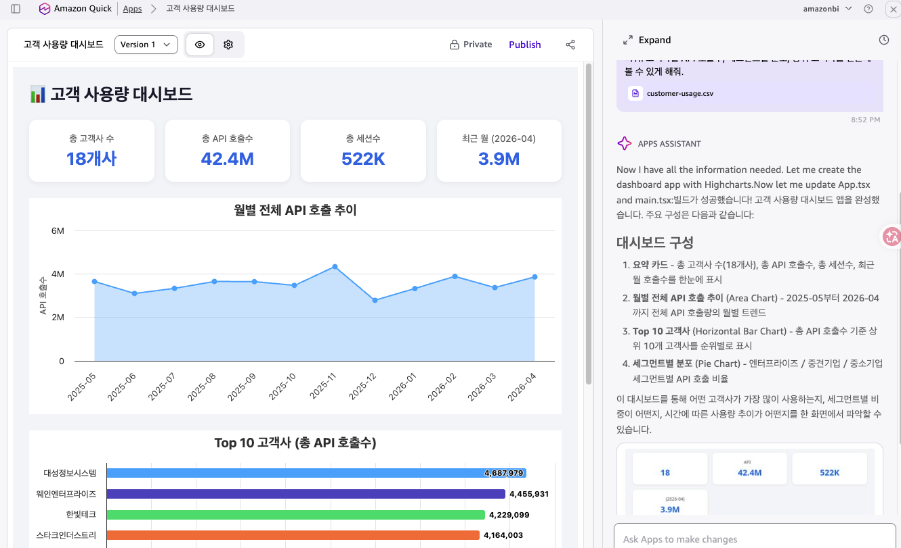
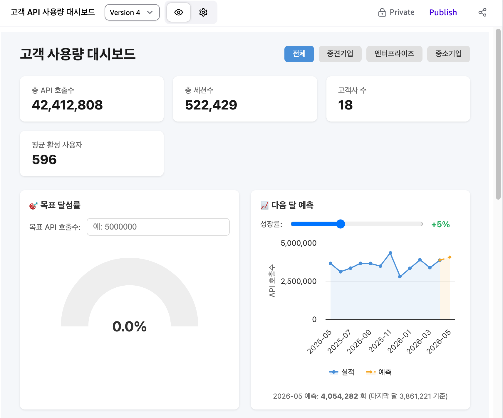
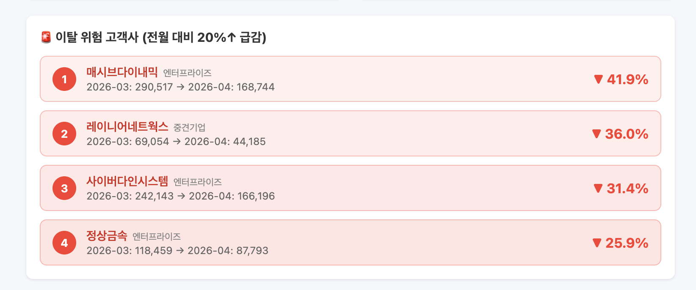
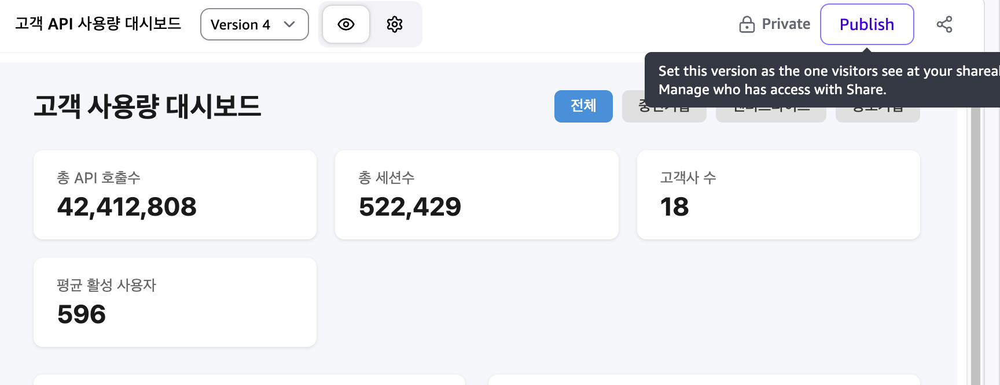
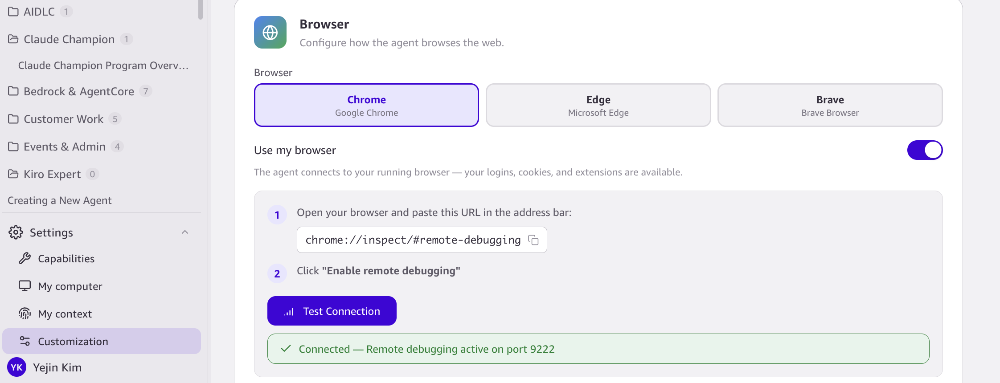
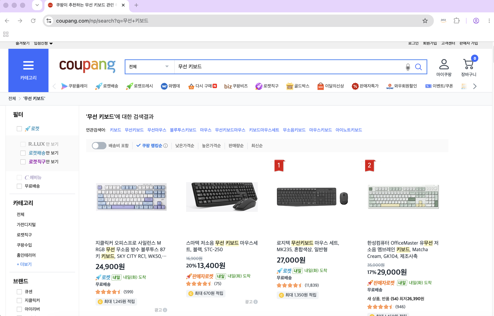
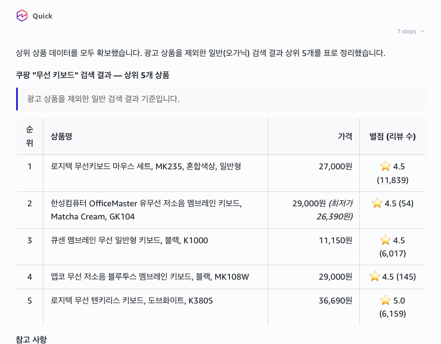

# STEP 5. Quick 차별 기능

> Quick만의 4가지 차별 기능을 훑어봅니다. Scheduled Agent · Apps · Knowledge Graph · Browser.

---

## 5-1. Scheduled Agent

정해진 시간에 자동으로 도는 에이전트를 만듭니다.

```
매일 아침 8시에 내 이메일을 요약해서 알려주는 에이전트를 만들어줘.
```

→ 승인하면 생성 + 즉시 테스트 실행. 결과는 오른쪽 위 **Activity Feed** 에 표시됩니다.

> **주의:** 이메일 Connection이 필요합니다. (STEP 4에서 연결)

변형:

```
회의 30분 전에, 내가 준비 안 한 미팅이 있으면 알려주는 에이전트를 만들어줘.
```

**임원 주간보고 자동 종합 (M365 조합)**

```
매주 월요일 오전 9시에 팀별 주간보고 메일을 종합하는 에이전트를 만들어줘.
지난 7일간 "주간보고" 라는 단어가 제목에 포함된 Outlook 메일을 모아서, 팀별로 진행사항·성과·이슈·의사결정 필요 항목으로 정리한 뒤 임원용 요약 리포트를 만들고, SharePoint의 "임원 주간보고" 폴더에 "week-YYYY-MM-DD.md"로 저장해줘. 완료되면 Teams로 요약 카드도 보내줘.
```

**Slack/Teams 키워드 트리거**

```
Slack에서 내가 속한 채널에 "긴급" 또는 "blocker" 또는 "장애"라는 키워드가 등장하면, 해당 메시지 앞뒤 컨텍스트를 요약해서 나한테 DM으로 알려주는 에이전트를 만들어줘. 하루 최대 5회로 제한하고, 반복되는 동일 스레드는 한 번만 알림.
```

**메일 분류·일일 브리핑 (M365 조합)**

```
매일 오전 8시 30분에 내 Outlook 수신함을 스캔하는 에이전트를 만들어줘.
지난 24시간 신착 메일을 회신 필요 / 자료 제공 / 승인 / 일정 조율 4가지로 분류하고, 각 메일에서 마감·담당자·요청사항을 추출해줘. 결과를 오늘의 브리핑 카드 형태로 정리해서 Teams에 발송해줘. 카드에는 분류별 개수·긴급 항목 하이라이트·원본 메일 링크가 포함돼야 해.
```

---

## 5-2. Apps (대시보드)

Quick 안에서 실행되는 인터랙티브 앱을 코드 없이 채팅으로 만듭니다. STEP 3의 HTML 대시보드와 Quick Apps는 둘 다 인터랙티브지만, **어디서 실행되고 어떻게 공유되느냐**가 다릅니다.

**STEP 3 HTML 대시보드 vs Quick Apps**

<table><thead><tr><th width="220">방식</th><th>결과물</th><th>실행 위치</th><th>공유 방식</th></tr></thead><tbody>
<tr><td>STEP 3 HTML 대시보드</td><td>인터랙티브 HTML 파일</td><td>브라우저 (서버 불필요)</td><td>파일 전달 (누구나)</td></tr>
<tr><td>Quick Apps</td><td>인터랙티브 앱</td><td>Quick 내부</td><td>Publish / 링크 (Quick 사용자)</td></tr>
</tbody></table>

- **STEP 3**: 파일로 떨어져 Quick 없이도 누구에게나 공유
- **STEP 5-2**: Quick 안에서 계속 수정·확장·배포하는 도구

같은 `customer-usage.csv` 라도 Quick Apps로 만들면 요약 카드, 월별 추이, Top 고객사, 세그먼트 분포가 한 화면에 조립되고, "Ask Apps to make changes"로 계속 진화시킬 수 있습니다.

### 기본 앱 만들기

```
./customer-usage.csv 데이터로 고객 사용량 대시보드 앱을 만들어줘. 고객사별 API 호출수, 세그먼트별 분포, Top 고객사를 한 화면에서 볼 수 있게 해줘.
```

Quick 내부의 Apps 화면에 **요약 카드 + 월별 추이 + Top 10 + 세그먼트 파이** 가 있는 앱이 생성됩니다.

<figure><figcaption>Amazon Quick Apps 안에서 실행되는 고객 사용량 대시보드</figcaption></figure>

### 추가 실습: 앱을 "도구"로 진화시키기

기본 대시보드에 아래 기능을 하나씩 얹으며 App만의 강점을 체감합니다. 모두 **"Ask Apps to make changes"** 에 채팅으로 요청하면 됩니다.

**실습 1. 인터랙티브 필터 / 드릴다운**

```
세그먼트(엔터프라이즈/중견기업/중소기업) 드롭다운 필터와 기간 선택을 추가해줘.
Top 고객사 막대를 클릭하면 그 고객사의 월별 상세가 아래에 표시되게 해줘.
```

**실습 2. What-if 입력 위젯**

```
목표 API 호출수를 입력하면 현재 달성률을 게이지로 보여주는 위젯을 추가해줘.
성장률 슬라이더를 움직이면 다음 3개월 예측치가 차트에 반영되게 해줘.
```

<figure><figcaption>목표 달성률 게이지 + 성장률 슬라이더로 다음 달 예측이 실시간 갱신되는 인터랙티브 위젯</figcaption></figure>

**실습 3. 이상치·헬스 하이라이트**

```
전월 대비 API 호출수가 20% 이상 급감한 고객사를 빨간색으로 표시하고,
이탈 위험 고객사 Top 5 카드를 상단에 추가해줘.
```

<figure><figcaption>전월 대비 20% 이상 급감한 고객사를 자동으로 뽑아 상단에 하이라이트</figcaption></figure>

### Publish 및 공유

앱 상단의 **Publish · 공유 아이콘 · Version 관리** 로 "만든 것을 실제로 배포"하는 단계까지 완결합니다.

<figure><figcaption>Publish 버튼 — 현재 버전을 공유 링크로 방문자에게 공개, Share로 접근 권한 관리</figcaption></figure>

> **정리:** Quick Apps는 채팅 한 줄로 인터랙티브 도구를 만들고, 수정하고, 공유하는 경험을 줍니다. STEP 3(공유용 정적 파일)와 함께 쓰면 "같은 데이터로 상황에 맞는 결과물을 골라 만든다"는 Quick의 강점을 완성할 수 있습니다.

---

## 5-3. Knowledge Graph

Quick이 축적한 내 컨텍스트(계정·사람·조직 관계)를 시각적으로 확인합니다.

**1.** **Settings**(왼쪽 아래 톱니) **→ My Context → Knowledge Graph** 를 엽니다.

**2.** 노드/관계를 확인합니다.

**3.** 채팅으로도 물어볼 수 있습니다.

```
내 Knowledge Graph 보여줘
```

또는

```
Quick이 [계정/사람]에 대해 뭘 알고 있어?
```

---

## 5-4. Browser (진짜 웹에서 찾아오기)

**셋업:**

**Settings → Customization → Browser** → 브라우저 선택(Chrome 등) → **"Use my browser"** 토글 ON → 안내대로 `chrome://inspect/#remote-debugging` 붙여넣고 **Enable remote debugging** → **Test Connection** → "Connected" 확인.

<figure><figcaption>브라우저 커스터마이징</figcaption></figure>

**써보기:**

```
쿠팡에서 "무선 키보드" 검색 결과 페이지를 열어서, 상위 5개 상품의 이름·가격·별점을 표로 정리해줘.
```

→ Quick이 실제로 브라우저를 열어 페이지를 읽어옵니다. 내 로그인/쿠키 그대로 사용됩니다.

<figure><figcaption>Quick이 열어서 읽고 있는 쿠팡 "무선 키보드" 검색 결과 페이지</figcaption></figure>

<figure><figcaption>페이지에서 뽑아낸 상위 5개 상품을 이름·가격·별점 표로 정리한 결과</figcaption></figure>

> **팁:** 검색(네이버 등)은 사이트가 막아서 잘 안 될 수 있어요. 쿠팡 검색이 막히면 상품 **URL을 직접** 주고 "이 상품 리뷰 요약해줘"로 하는 게 확실합니다.

---

## 5-5. 백그라운드 태스크 병렬 수행

복잡한 작업을 프롬프트 하나에 통째로 던지면 Quick이 순차 실행하지만, **"백그라운드 태스크 여러 개로 나눠서 병렬 수행"** 이라는 문구를 명시하면 Quick이 자동으로 서브태스크를 쪼개서 동시에 돌립니다. 워크샵에서 만드는 리포트·대시보드·다중 소스 조회처럼 부품이 여러 개일 때 특히 유용합니다.

**써보기:**

```
아래 작업을 백그라운드 태스크 여러 개로 나눠서 병렬 수행해줘.
1) ./research-folder/ 로 branded-report Skill로 임원 보고서 생성
2) ./call-transcripts/discovery-acme-corp.txt 를 qualify-lead Skill로 평가
3) ./customer-usage.csv 로 insight-dashboard 대시보드 생성
완료되면 각각의 결과 파일 경로를 알려줘.
```

→ 세 작업이 동시에 시작되어 순차 실행보다 훨씬 빠르게 끝납니다. 진행 상황은 오른쪽 위 **Activity Feed** 에서 각각 확인할 수 있고, 그 사이에 다른 채팅도 계속 이어갈 수 있습니다.

**동시 실행 개수 조정:**

**Settings → Customization → Performance → Max parallel tasks** (기본 50) 에서 조절 가능합니다.

> **Tip:** 개별 프롬프트 하나만으로도 무거운 작업(예: ops-report처럼 여러 CSV·MD를 취합하는 리포트)은 이 지시어를 붙이는 것만으로 눈에 띄게 빨라집니다. Quick에게 맡겨두고 다른 일을 진행하세요.

---

> **다음:** [STEP 6. 운영보고서 자동 생성 →](step-7-ops-report.md)
