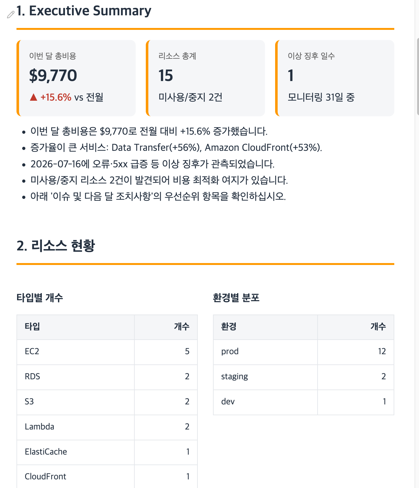

# STEP 6. 운영보고서 자동 생성 — ops-report

> 실제 고객 시나리오를 적용하는 STEP입니다. STEP 1에서 만든 **Skill**을 활용해, 여러 소스의 운영 데이터를 취합하여 **정형화된 월간 운영보고 PPT**를 자동 생성합니다. 한 번 만들어두면 "운영보고서"라고 말하는 것만으로 매월 보고서가 재생성됩니다.

***

## 시나리오: 클라우드메이트

클라우드메이트는 매월 아래 데이터를 손으로 취합해 운영보고서를 만듭니다. 이 반복 작업을 Quick Skill로 자동화합니다.

- 리소스 아키텍처 현황
- 빌링 비용·사용량
- Health / Trusted Advisor 특이사항
- 모니터링 1개월 추이
- 내부 서포트 포탈 변경/장애 데이터

> **이 STEP의 실습 범위**
> ①~④는 제공된 **샘플 데이터**로 진행하며, AWS 자격증명이 필요 없습니다. 실제 AWS 데이터를 실시간으로 붙이는 방법은 ⑤에서 다룹니다.

***

## ① Skill 생성 프롬프트

아래 프롬프트를 채팅에 붙여넣고 전송하세요.

```
운영보고서를 자동 생성하는 Skill을 만들어줘. 이름은 ops-report.

[입력 데이터]
- ops-billing.csv : 월별 서비스별 비용·사용량
- ops-monitoring.csv : 일별 모니터링 지표
- ops-resources.csv : 리소스 인벤토리
- ops-findings.md : Health/Trusted Advisor 특이사항 및 내부 포탈 티켓

[보고서 구조] 아래 순서로 HTML 보고서를 생성
1. 표지 — 제목 "월간 운영보고서", 보고 월, 계정명 "클라우드메이트"
2. Executive Summary — 이번 달 핵심 3~5줄 (비용 증감, 주요 장애, 조치 필요 항목)
3. 리소스 현황 — 타입별 개수, 환경(prod/staging/dev)별 분포, 미사용 리소스 표시
4. 비용·사용량 — 전월 대비 총비용 증감률, Top 5 서비스, 증가율 큰 서비스 강조
5. 모니터링 요약 — 월간 평균/피크, 이상 징후가 있던 날짜 강조
6. 특이사항 — Health 이벤트, Trusted Advisor 경고, 내부 장애/변경 티켓 정리
7. 이슈 및 다음 달 조치사항 — 우선순위 순으로 정리

[브랜드 색상] 다크 #232F3E, 액센트 #FF9900, 흰 배경
[레이아웃]
- 섹션 제목에 #FF9900 하단 보더
- 비용/모니터링은 표로, 증감은 화살표(▲/▼)와 색상으로 표시
- 경고/조치 필요 항목은 강조 박스(#FFF8F0)
- 푸터: "Generated with Amazon Quick"

[본문 언어] 한국어
[저장 위치] ./output/ 에 ops-report-YYYY-MM.html 로 저장
[자동 적용] "운영보고서"라는 단어가 나오면 이 Skill을 자동 적용

이 내용을 재사용 가능한 Skill로 저장해줘.
```

***

## ② 권한 승인

파일 접근이나 저장 권한을 물어보면 → **허용**.

***

## ③ 생성 확인

왼쪽 **Agents & skills 패널**에 `ops-report`가 나타나면 성공입니다.

<figure><figcaption>ops-report Skill로 생성된 운영보고서 상단 예시 (Executive Summary + 리소스 현황)</figcaption></figure>

***

## ④ 바로 써보기

아래 프롬프트로 7월 운영보고서를 생성해봅니다. 리포트는 4개 데이터 소스를 취합하므로 **백그라운드 태스크로 나눠서 병렬 수행**하도록 지시하면 훨씬 빠르게 끝납니다. (STEP 5-5 참고)

```
./ops-data/ 의 데이터로 2026년 7월 운영보고서를 만들어줘.
전월(6월) 대비 비용 증감과 7/16 장애를 반드시 짚어줘.
백그라운드 태스크 여러 개로 나눠서 병렬 수행해줘.
```

생성된 보고서에 다음이 반영됐는지 확인합니다.

- 7월 총비용이 6월 대비 약 +10% 증가로 표시되는지
- CloudFront / Data Transfer 증가가 강조되는지
- 7/16 Lambda 오류 급증과 결제 API 장애(INC-2451)가 특이사항에 나오는지
- 미사용 Elastic IP 등 Trusted Advisor 경고가 조치사항에 포함되는지

> **Tip:** 병렬 지시어를 붙이면 Quick이 자동으로 서브태스크(빌링 분석 · 모니터링 분석 · 리소스 정리 · 특이사항 정리)를 동시에 돌립니다. 생성 중에 채팅창에서 다른 질문도 이어갈 수 있어요.

***

## ④-2 (선택) 발표 덱까지

```
방금 만든 7월 운영보고서를 경영진 보고용 발표 덱(.pptx)으로 만들어줘.
표지, Executive Summary, 비용, 장애 요약, 다음 달 조치사항 순서로.
먼저 목차 개요를 보여주고 승인받은 뒤 생성해줘.
```

목차를 확인하고 승인하면 `.pptx`가 생성됩니다.

***

## ⑤ 실전 확장 — 실제 AWS 데이터 연결

지금까지는 샘플 파일로 실습했습니다. 실제 운영 환경에서는 **Quick Desktop의 MCP 서버**로 AWS 데이터를 실시간으로 가져와 `ops-report` Skill에 그대로 물릴 수 있습니다.

> **사전 준비 (로컬)**
> - `uv` 설치 (`uvx` 명령 사용) — 없으면 `curl -LsSf https://astral.sh/uv/install.sh | sh`
> - AWS CLI 자격증명 구성 후 `aws sts get-caller-identity` 로 유효성 확인

### MCP 서버 추가

**Settings → Capabilities → Connectors → MCP Servers → + Create → MCP server → Local** 을 선택하고 아래처럼 입력합니다. (`awslabs.aws-api-mcp-server` 하나로 15,000+ AWS API를 호출할 수 있어 아키텍처·Health·Trusted Advisor를 모두 커버합니다.)

| 필드 | 값 |
|---|---|
| Name | `aws-api-mcp-server` |
| Command | `uvx` |
| Arguments | `awslabs.aws-api-mcp-server@latest` |
| Env: `AWS_PROFILE` | (본인 프로파일명, 예: `default`) |
| Env: `AWS_REGION` | `ap-northeast-1` |
| Env: `FASTMCP_LOG_LEVEL` | `ERROR` |

> **주의**: `Command`에는 `uvx` 만 넣고, `awslabs.aws-api-mcp-server@latest` 는 반드시 `Arguments`로 분리합니다. 저장 후 도구 수(tools)가 0이면 대개 **자격증명 만료**이니, 자격증명을 갱신하고 서버를 껐다 켜세요.

### 소스별 연결 방법

| 데이터 | 연결 방법 | 전제 |
|---|---|---|
| 아키텍처/리소스 | `aws-api-mcp-server` (Local, uvx) | AWS 자격증명 |
| 빌링 비용·사용량 | `awslabs.billing-cost-management-mcp-server` (Local, uvx) | Cost Explorer 활성화 |
| 모니터링 추이 | `awslabs.cloudwatch-mcp-server` (Local, uvx) | AWS 자격증명 |
| Health 특이사항 | 위 `aws-api-mcp-server`로 Health API 호출 | Business/Enterprise Support |
| Trusted Advisor | 위 `aws-api-mcp-server`로 TA API 호출 | Business+/Enterprise Support, us-east-1 |
| 내부 서포트 포탈 | 시스템별 커스텀 MCP 또는 REST API 어댑터 개발 필요 | 내부 시스템 API 접근 권한 |

### 실행

MCP 연결 후, ④에서 만든 `ops-report` Skill을 그대로 실행하되 입력만 실제 데이터로 바꿉니다.

```
내 AWS 계정의 이번 달 비용, 리소스 현황, CloudWatch 모니터링 지표,
Trusted Advisor 경고를 가져와서 운영보고서를 만들어줘.
```

> **핵심**: `ops-report` Skill은 데이터 소스가 샘플 파일이든 실제 MCP 출력이든 **동일하게 동작**합니다. 그래서 실습에서 만든 Skill을 그대로 실전에 재사용할 수 있습니다.

***

> **다음:** [STEP 7. 최종 체크 →](step-6-checklist.md)
